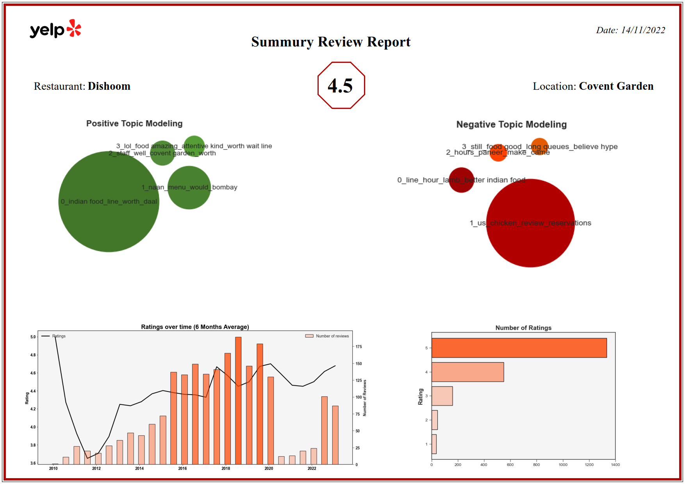

# Yelp | Web Scrape | Report Creation

This repository contains two Python scripts that allow you to scrape Yelp for restaurant reviews and generate a report in the form of a PDF. These scripts are written in Jupyter notebook and are intended for personal use.

## Table of Contents
1. [About The Project](#about-the-project)
2. [Installation](#installation)
3. [Usage](#usage)
4. [License](#license)


## About The Project
This project consists of two parts:

1. `Yelp Scrape Function.ipynb` - This script is used to scrape Yelp for the top 10 restaurants based on your specified food and city. The script then generates a CSV file containing metadata for the first restaurant on the list along with all its reviews.

2. `Yelp Summarize Function.ipynb` - This script reads the previously generated CSV file and creates a PDF report based on the restaurant metadata and its reviews.

## Installation
To get started, clone the repository using this command:

```bash
git clone https://github.com/panagiotisgia/Yelp_Review_Summarization.git
```
## Usage

Run `Yelp Scrape Function.ipynb` in Jupyter Notebook. This script will prompt you to enter your desired food and city. Upon execution, it will create a CSV file with metadata of the top-rated restaurant regarding the input food and city along with all its reviews.

After the CSV is created, run `Yelp Summarize Function.ipynb`. This script will read the CSV file and generate a PDF report containing metadata about the restaurant and its reviews.

Here is a sample output of the PDF report: <br>
(Food: Indian Food,  City: London)



To download the full PDF report, click [here](Dishoom_Covent%20Garden_summary_report.pdf).

## License
This project is licensed under the Apache License 2.0. This is a permissive license whose main conditions require preservation of copyright and license notices. Contributors provide an express grant of patent rights. Licensed works, modifications, and larger works may be distributed under different terms and without source code.

For more information, see the `LICENSE` file in this repository or visit [Apache License 2.0](https://www.apache.org/licenses/LICENSE-2.0.html).
